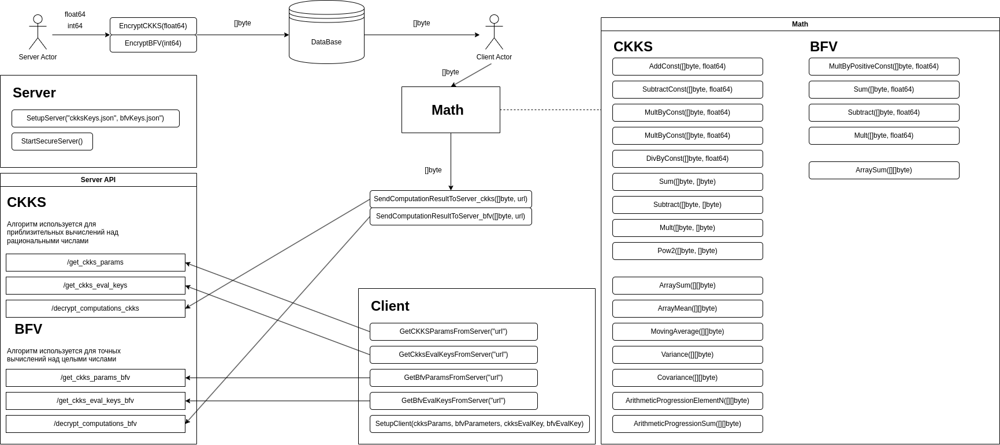

# Homomorphic Encryption Library for Secure Data Processing

A high-level library for **homomorphic encryption**, designed to simplify secure 
data processing and exchange between organizations.  Built on top of 
[Lattigo v2](https://github.com/tuneinsight/lattigo), this library provides an
easy-to-use interface for deploying secure servers and clients, performing
computations on encrypted data, and ensuring data confidentiality.

---

## 📚 Table of Contents
- [🎯 Motivation](#-motivation)
- [🔍 Existing Solutions](#-existing-solutions)
- [🎯 Library Purpose](#-library-purpose)
- [🔐 Implemented Encryption Schemes](#-implemented-encryption-schemes)
- [💼 Use Cases](#-use-cases)
- [⚙️ How It Works](#-how-it-works)
- [🚀 Quick Start](#-quick-start)
- [📜 License](#-license)

---

## 🎯 Motivation

Organizations often possess valuable datasets that require significant
resources to gather. Sharing these datasets can foster mutually beneficial collaborations, but direct data exchange poses several challenges:

- **🔒 Data Security**: Not all data is safe to share, as it may contain sensitive 
information that could compromise confidentiality or organizational interests.
- **⚡ Computation Overhead**: Requesting computations from data owners can be 
inefficient, as it consumes their computational resources and may require disclosing proprietary algorithms.

**Solution**: This library leverages **homomorphic encryption** to enable secure 
data processing. Clients can perform computations on encrypted data without decryption, 
ensuring data confidentiality and protecting intellectual property.

---

## 🔍 Existing Solutions

While several libraries exist for homomorphic encryption (e.g., **Lattigo** for Go), 
they often have a steep learning curve and require additional effort to:

- Write custom wrappers for their functions.
- Configure HTTPS servers and implement logic for encrypted data exchange.

**Advantage**: This library provides a streamlined solution with:
- Pre-configured HTTPS servers.
- Ready-to-use functions for encryption, decryption, and mathematical operations.
- High-level operations like variance and covariance calculations.

---

## 🎯 Library Purpose

This library is designed to:
- Lower the entry barrier for developers working with homomorphic encryption.
- Provide tools for:
    - Deploying pre-configured HTTPS servers.
    - Performing mathematical operations on encrypted data.
    - Exchanging encrypted data between clients and servers.

---

## 🔐 Implemented Encryption Schemes

The library supports two homomorphic encryption schemes:

| Scheme   | Purpose                                                    |
|----------|------------------------------------------------------------|
| **CKKS** | Approximate computations on real numbers (floating-point). |
| **BFV**  | Exact computations on integers.                            |     

---

## 💼 Use Cases

This library is ideal for scenarios where:
- Data must remain confidential during processing.
- Clients need to perform computations on encrypted data without accessing raw data.

**Examples**:
- **📊 CKKS**: Machine learning on encrypted data, encrypted signal processing.
- **💰 BFV**: Financial calculations(like auctions, bidding, tax calculations etc.), secure voting systems. 

---

## ⚙️ How It Works

The interaction between the client and server follows these steps:

1. **Server Setup**: The server listens for incoming HTTPS connections.
2. **Client Request**: The client requests encryption parameters and keys from the server.
3. **Data Processing**: The client performs computations on encrypted data.
4. **Result Submission**: The client sends the encrypted results to the server.
5. **Decryption**: The server decrypts the results and sends them back to the client.
6. **Final Output**: The client receives the decrypted computation results.

---

## 🚀 Quick Start
Check [Server setup guide](examples%2Fserver%2FREADME.md)
and [Client setup guide](examples%2Fclient%2FREADME.md)

---

## 📜 License
This project is licensed under the MIT License. See the LICENSE file for details.

---

🌟 Star this repo if you find it useful! 🌟
